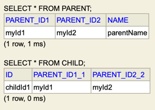

# 복합키 : 비식별 관계 매핑
부모 테이블의 기본 키를 받아서 자식 테이블의 외래키로만 사용하는 관계

|PARENT|
|:---:|
|PARENT_ID1(PK)<br>PARENT_ID2(PK)|
|NAME|

|CHILD|
|:---:|
|CHILD_ID(PK)|
|PARENT_ID1(FK)<br>PARENT_ID2(FK)<br>NAME|

복합키를 매핑하기 위해 식별자 클래스를 별도로 만들어야 한다.
```java
@Entity
@IdClass(ParentId.class)
public class Parent {
    @Id
    @Column(name = "PARENT_ID1")
    private String id1;

    @Id
    @Column(name = "PARENT_ID2")
    private String id2;

    private String name;
}
```
## 식별자 클래스
```java
public class ParentId implements Serializable {
    private String id1;
    private String id2;

    public ParentId() {
    }

    public ParentId(String id1, String id2) {
        this.id1 = id1;
        this.id2 = id2;
    }

    @Override
    public int hashCode() {
        return super.hashCode();
    }

    @Override
    public boolean equals(Object obj) {
        return super.equals(obj);
    }
}
```
@IdClass를 사용하기 위해서는
1. 식별자 클래스의 속성명과 엔티티에서 사용하는 식별자의 속성명이 같아야한다. (id1, id2)
2. Serializable 인터페이스를 구현해야함
3. 기본 생성자가 있어야 함
4. 식별자 클래스를 public이어야 함
```java
@Entity
public class Child {
    @Id
    private String id;

    @ManyToOne
    @JoinColumns({
            @JoinColumn(name = "PARENT_ID1_1", referencedColumnName = "PARENT_ID1"),
            @JoinColumn(name = "PARENT_ID2_2", referencedColumnName = "PARENT_ID2")
    })
    private Parent parent;
}
```
@JoinColumn의 name속성과 referencedColumnName 속성의 값이 같으면 referencedColumnName는 생략해도 된다.

